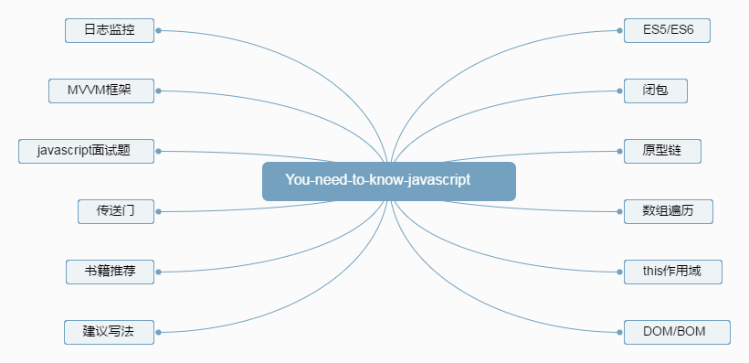

# You-need-know-javascript

> 作为一名前端工程师，你必须知道的一些javascript知识点

### 索引目录
- ES5/ES6
- 闭包
- this作用域
- proptype原型
- 数组遍历
- DOM/BOM
- MVVM框架
- 日志监控
- javascript相关面试题
- 学习资源
- 书籍推荐

### 闭包
> 产生闭包的原因，哪些场景会用到闭包

1. 闭包的使用场景

### ES5/ES6
> ES6新增的一些特性

1. 箭头符号

